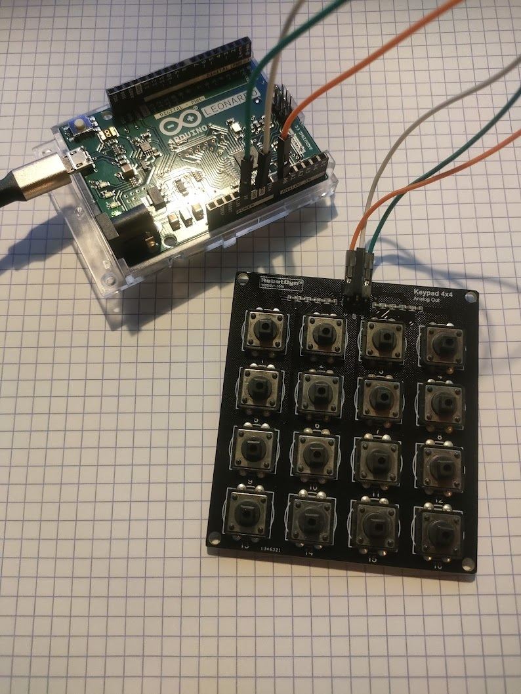
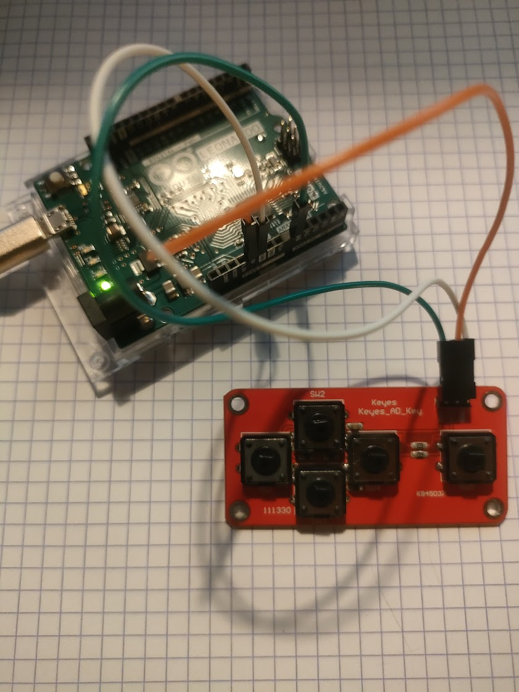

# simulator_keypad

## A simple 4x4 keypad

 Mapping for Condor Soaring
 


### Hardware
- Analog keypad 4x4 https://fr.aliexpress.com/item/32635207928.html?gatewayAdapt=glo2fra&spm=a2g0o.9042311.0.0.277c6c37tAJ6Zn
- Arduino Leonardo https://www.arduino.cc/en/Main/Arduino_BoardLeonardo
- 3 wires

### Key mapping


## A 5 buttons keypad

4 directional button and press a key



### Hardware
- 5 keys analog keypad (directional) https://fr.aliexpress.com/item/2044851328.html?gatewayAdapt=glo2fra&spm=a2g0o.9042311.0.0.277c6c37tAJ6Zn
- Arduino Leonardo https://www.arduino.cc/en/Main/Arduino_BoardLeonardo
- 3 wires

## See
- Keyboard.h https://github.com/arduino-libraries/Keyboard/blob/master/src/Keyboard.h
- ezAnalogKeypad https://github.com/ArduinoGetStarted/Analog-Keypad
- Joystick.h https://github.com/MHeironimus/ArduinoJoystickLibrary/blob/master/src/Joystick.h

# Compilation
## IDE Arduino
Tools / Board type : Arduino Leonardo
Port : COM...
Verify/compile CTRL+R
Upload CTRL+u

## Arduino CLI
```bash
> arduino-cli core update-index
> arduino-cli core search leonardo
> arduino-cli core install arduino:avr
> arduino-cli core list
ID              Installé Latest Name
arduino:avr     1.8.4    1.8.4  Arduino AVR Boards
> arduino-cli board list
Port  Protocol Type              Board Name       FQBN                 Core
COM12 serial   Serial Port (USB) Arduino Leonardo arduino:avr:leonardo arduino:avr
> arduino-cli board listall
Board Name                        FQBN
Adafruit Circuit Playground       arduino:avr:circuitplay32u4cat
Arduino BT                        arduino:avr:bt
Arduino Duemilanove or Diecimila  arduino:avr:diecimila
...
Arduino Leonardo                  arduino:avr:leonardo
Arduino Leonardo ETH              arduino:avr:leonardoeth
...
SparkFun RedBot                   SparkFun:avr:RedBot
SparkFun SerLCD                   SparkFun:avr:SerLCD
SparkFun Serial 7-Segment Display SparkFun:avr:Serial7Seg
> arduino-cli compile --fqbn arduino:avr:leonardo sketch_...
> arduino-cli upload --fqbn arduino:avr:leonardo sketch_... --port COM12
```
